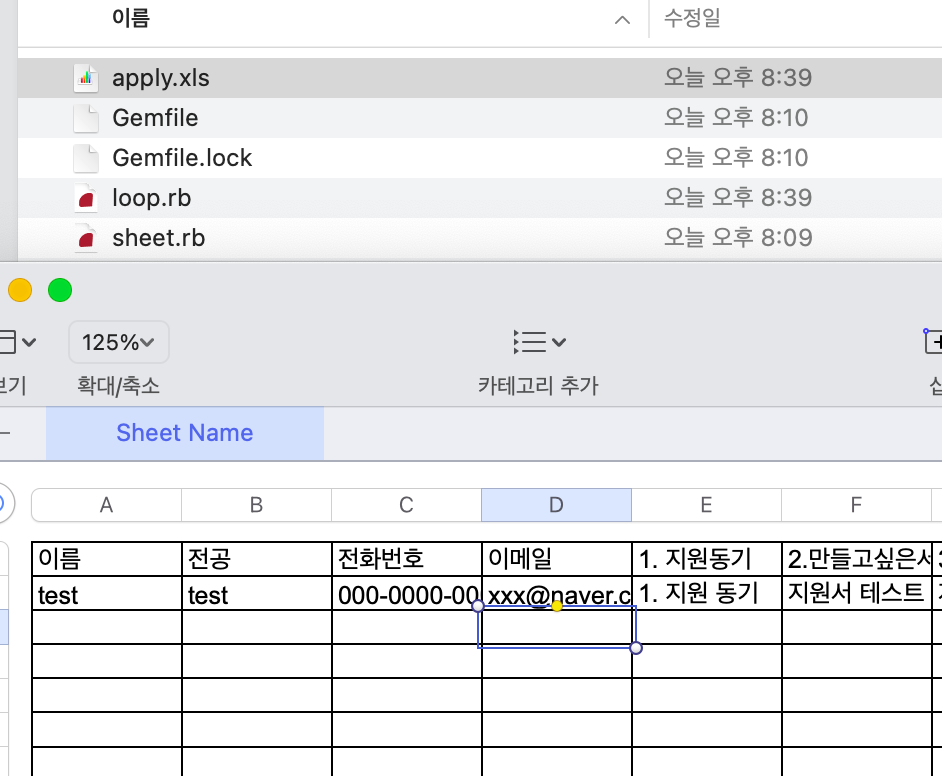

사용법 
===

1. `git clone` 으로 해당 레포 클론
2. `gem install bundler`로 번들러 설치
3. . `bundle install` 으로 Gemfile 에 있는 gem을 설치함 
4. 주석을 보고 loop.rb 파일을 수정후 `ruby loop.rb` 로 파일을 실행
5. 지원자의 정보가 정리된 파일 생성 

---

지원자의 이름, 전공, 핸드폰번호, 이메일, 공통질문1, 공통질문2, 개별질문1, 개별질문2, 개별질문3의 순서로 정리된 엑셀(xls)파일을 자동생성합니다. 

c9.io 에서 테스트했습니다!!  

macOS Big Sur ruby 2.7.0  
9기때 사이트가 코드가 변경없이 재사용 하여서 업데이트 하였습니다. 

### 이름 학과 전화번호 메일 순서로 나옵니다.  

`git clone` 을 통해서 해당 레포지토리를 클론한다.  

bash 창에 `ruby -v`를 입력하여서 본인의 ruby 버전을 확인한다.  

Gemfile 에있는 ruby 버전을 본인의 버전에 맞게 고쳐준다.  

ruby가 설치되어있지 않다면 구글링으로 간편하게 루비 설치  

터미널에 아래 명령어를 입력하여 bundler 를 설치한다.  

`$ gem install bundler`

Gemfile 이 있는 'ruby_file' 폴더로 들어가 터미널에 아래 명령어를 입력하면 자동으로 gem을 설치한다.  

`$ bundle`   

loop.rb파일에 들어가 주석 5가지를 보고 5부분을 수정한다.  

주석은 아래와 같다.  

1. 9번째줄 UNIV_EMAIL = 학교 계정 이메일주소
2. 10번째줄 PASSWORD = 학교 계정 비번
3. 12번째줄 NUMBER = URL 상의 본인 학교 넘버링
4. 20번째줄의 학교별 개별 질문 1 ~ 3의 질문을 작성한다. 
5. 30번째줄의 NUMBER = 본인학교에 제출된 인원의 숫자를 적는다

`$ ruby loop.rb`를 실행한다.  

지원자들의 지원서내용이 작성된 apply.xls 파일이 생성되어있다.  
  
